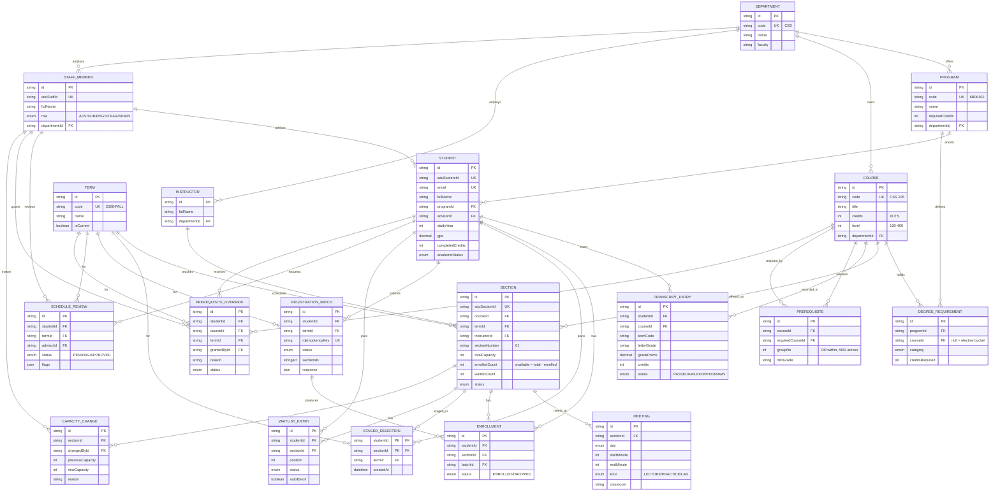

# Database ER Diagram

Entity–relationship diagram of the PostgreSQL schema (`prisma/schema.prisma`), 20 tables.

**Ownership:** the mirror tables (students, transcripts, catalog, sections, enrollments) are refreshed from SDU and keyed by `sdu*Id`; the app owns the planning tables (staged selections, batches, waitlist, reviews, overrides, capacity changes). Live seat counts come from SDU — `enrolledCount`/`totalCapacity` here is the mirrored total.

> `PK` primary key · `FK` foreign key · `UK` unique · `||--o{` one-to-many.

## Reading the model

- **Academic structure** — `TERM`, `DEPARTMENT`, `PROGRAM`, `DEGREE_REQUIREMENT` define what exists and what a degree requires.
- **People** — `STUDENT`, `STAFF_MEMBER` (advisor/registrar/admin), `INSTRUCTOR`.
- **Catalog** — `COURSE`, `PREREQUISITE` (self-referencing CNF: rows sharing `groupNo` are OR, different groups are AND), `SECTION`, `MEETING`.
- **Academic record** — `TRANSCRIPT_ENTRY` (one row per course taken).
- **Registration (app-owned)** — `STAGED_SELECTION` (the planning cart) → `REGISTRATION_BATCH` (one atomic submit) → `ENROLLMENT`; `WAITLIST_ENTRY` for full sections.
- **Advising & admin** — `SCHEDULE_REVIEW` (advisor sign-off), `PREREQUISITE_OVERRIDE` (granted exception), `CAPACITY_CHANGE` (registrar seat adjustment, audited).
